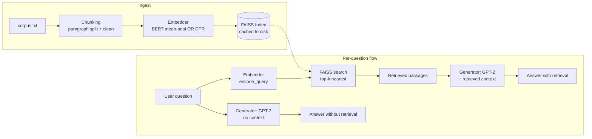

# RAG From Scratch

**A retrieval-augmented generation engine built without LangChain or any retrieval framework** — embeddings, FAISS indexing, and generation are all implemented directly with PyTorch and Hugging Face Transformers, so every step of the RAG pipeline is visible and explainable rather than hidden behind a library call.

The demo answers questions about my own coursework and projects (the corpus is my IBM Generative AI Engineering certificate content + my other portfolio projects), and shows **two answers side by side**: one generated with no external context, and one generated after retrieving relevant passages. The gap between them is the entire point of RAG.

> This is a companion piece to a second project, **[Multi-Tool RAG Agent](#)**, which builds on top of a framework (LangChain) instead of from scratch. Together they show both "I understand the internals" and "I can ship a framework-based application."

---

## Why build RAG from scratch when LangChain exists?

Anyone can call `VectorStoreQA.from_chain_type(...)`. This project exists to demonstrate the layer underneath that call:

- How raw text becomes a fixed-size vector (mean-pooled BERT vs. a purpose-built DPR dual-encoder)
- How a FAISS index actually performs nearest-neighbor search
- How retrieved context changes what a language model generates, measured, not assumed

## Architecture



## Project structure

```
rag-from-scratch/
├── app.py                       # Flask routes (/, /api/ask, /api/health)
├── src/
│   ├── config.py                 # All model names, paths, hyperparameters
│   ├── chunking.py                # corpus.txt -> clean paragraph chunks
│   ├── embeddings_bert.py         # Backend 1: BERT mean-pooling embedder
│   ├── embeddings_dpr.py          # Backend 2: DPR dual-encoder embedder
│   ├── index_store.py             # FAISS index wrapper, with save/load caching
│   ├── retrieval.py                # Ties embedder + index together
│   ├── generation.py               # GPT-2 generation, with/without context
│   └── pipeline.py                  # Top-level orchestrator used by Flask
├── scripts/
│   └── evaluate_retrieval.py        # Hit Rate@k / MRR eval, BERT vs DPR
├── tests/                            # pytest suite (offline, no model downloads)
├── templates/index.html               # Frontend markup
├── static/style.css, script.js         # Frontend styling + behavior
├── data/corpus.txt                      # The personal knowledge base
└── cache/                                # Auto-generated FAISS indexes (gitignored)
```

## Setup

Requires Python 3.10+. Model downloads need internet access to Hugging Face Hub (first run only — everything is cached to disk afterward).

```bash
git clone <this-repo-url>
cd rag-from-scratch
python3 -m venv venv
source venv/bin/activate        # Windows: venv\Scripts\activate
pip install -r requirements.txt
cp .env.example .env             # optional -- defaults work out of the box
python3 app.py
```

Open `http://localhost:5000`. The first question you ask will take longer (models load + index builds); every question after that is fast.

## Running the retrieval evaluation

```bash
python3 scripts/evaluate_retrieval.py
```

This runs 12 labeled test questions against both embedder backends and reports **Hit Rate@5** and **Mean Reciprocal Rank (MRR)** — see the script for the exact methodology. This is what backs up "BERT vs. DPR" with numbers instead of a guess.

## Running the tests

```bash
pytest tests/ -v
```

The test suite uses a fake embedder (deterministic, no model download) so it runs in seconds and works offline — it tests the chunking, indexing, and retrieval *logic*, not the specific embedding model's quality (that's what the evaluation script is for).

## Design decisions & tradeoffs

Being upfront about this is more useful than pretending this is a production system:

| Decision | Why | What production would do instead |
|---|---|---|
| **GPT-2 as the generator** | Runs on CPU, no API key, fully self-contained for anyone cloning the repo | An instruction-tuned model (GPT-4/Claude/Llama-Instruct) behind an API — GPT-2 is not instruction-tuned, so its "answers" are continuations, not chat responses |
| **Local FAISS `IndexFlatL2`** | Simple, no external service, fine for a few dozen documents | A managed vector DB (Pinecone, Weaviate, pgvector) with approximate nearest neighbor search for millions of documents |
| **Corpus held in memory / flat file** | Easy to inspect and version-control as plain text | A real document ingestion pipeline (chunked PDFs, DBs, incremental updates) |
| **Flask dev server** | Fast to stand up for a demo | Gunicorn/uWSGI behind a reverse proxy, with health checks and horizontal scaling |
| **No auth / rate limiting** | Out of scope for a portfolio demo | API keys, rate limiting, request logging, and monitoring for a public-facing service |

## What this demonstrates

- Tokenization, embeddings, and attention mechanisms (from the IBM Generative AI Engineering coursework this project is built on)
- Retrieval-augmented generation implemented at the mechanics level, not just via a framework
- Comparative evaluation methodology (Hit Rate, MRR) rather than anecdotal "it seems to work"
- A complete, tested, documented full-stack deliverable: backend, frontend, tests, evaluation, and deployment-readiness

---

Built by Tanish Shetty as part of the IBM Generative AI Engineering Professional Certificate portfolio.
